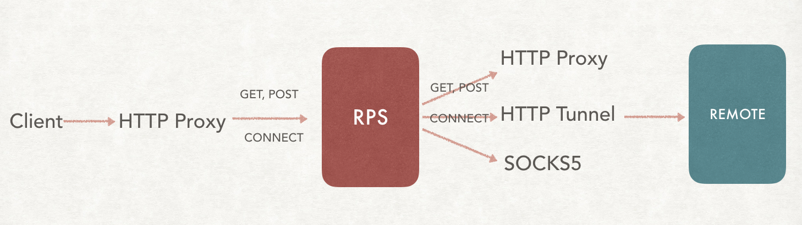
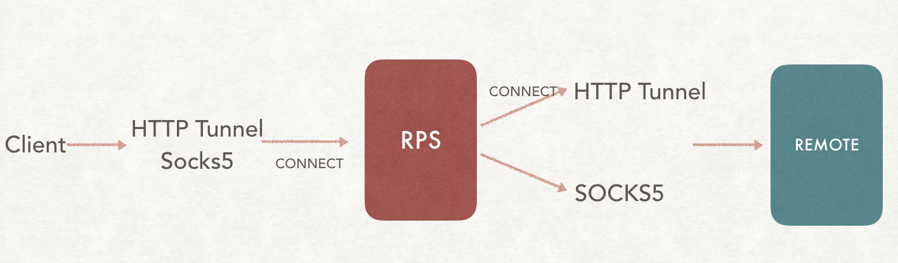

## Hybrid Mode

If hybrid be enabled, the request via http proxy will be forwarded via various upstream proxy protocol(HTTP proxy, HTTP tunnel, Socks5).
A TCP tunnel will be established based on HTTP Tunnel and socks5 protocol and any application layer protocol work on TCP are supported besides HTTP request.
However, the request via HTTP tunnel or socks5 proxy can only be forwarded via HTTP tunnel or socks5 tunnel due to HTTP proxy only support HTTP request.

**HTTP Proxy Request**

**HTTP/Socks5 Tunnel Request**

